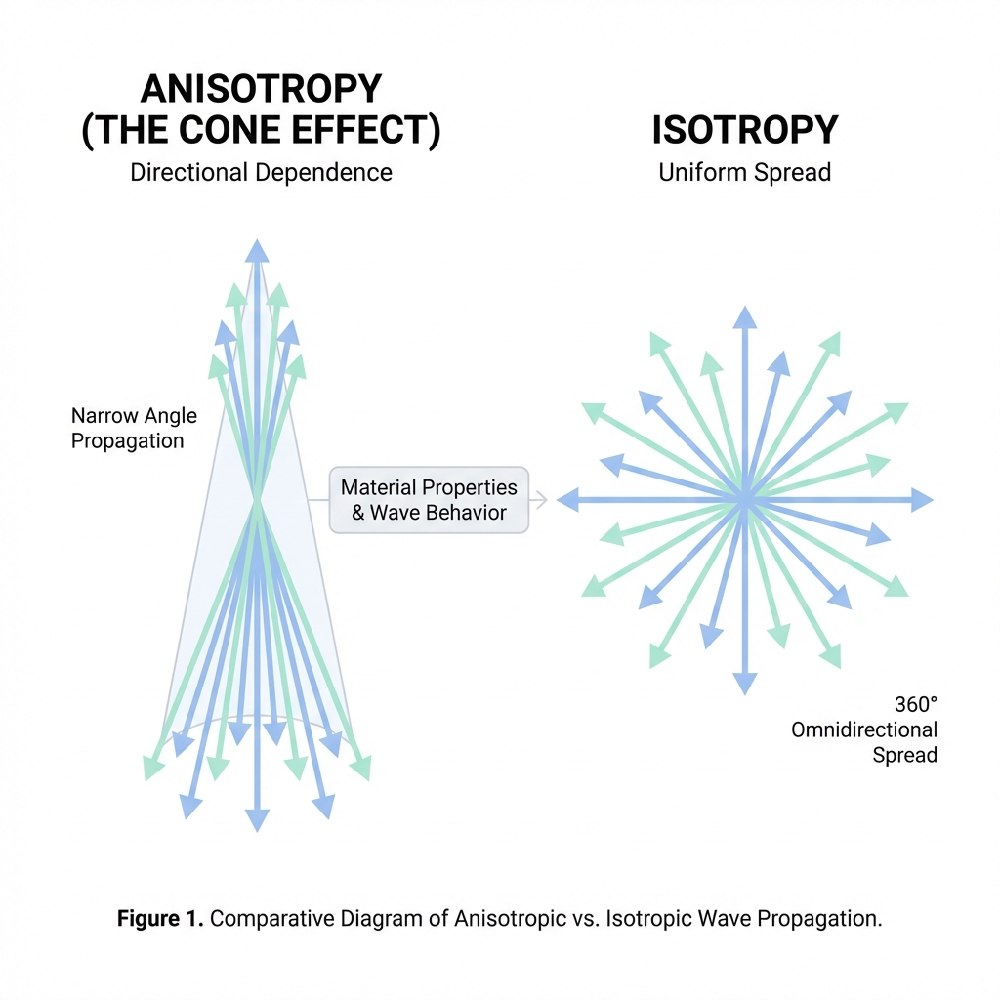

## 🎭 The Adaptation Dichotomy: MLM vs. CL

Evaluation metrics should be interpreted differently depending on the fine-tuning strategy employed:

### 1. Masked Language Modeling (MLM) = Domain Adaptation
*   **Goal**: Pre-condition the encoder to understand the "language of the domain" (e.g., e-commerce jargon, brand relationships).
*   **Focus**: **Layer 1 (Intrinsic)** and **Layer 3 (Behavioral)**.
*   **Key Indicator**: Improved **Alignment** and reduced **Anisotropy** without necessarily boosting nDCG immediately. It mitigates the effects of **Tokenizer Fragmentation** by teaching the model to reconstruct domain terms.

### 2. Contrastive Learning (CL) = Task Adaptation
*   **Goal**: Optimize the vector space for the specific "Search Task" (Query → Product).
*   **Focus**: **Layer 2 (Extrinsic)**.
*   **Key Indicator**: Significant uplift in **nDCG@10** and **Recall@K**. However, over-focusing on CL can lead to **Catastrophic Forgetting**, where general language capability (measured by **JMTEB**) degrades.

---

### Comparison Matrix

| Feature | MLM (Domain Adaptation) | CL (Task Adaptation) |
| :--- | :--- | :--- |
| **Primary Data** | Unlabeled Product Titles/Descriptions | Labeled Query-Product Pairs |
| **Learns** | "E-commerce grammar" & Jargon | "Search Intent" & Ranking Logic |
| **Key Metric** | Alignment, Anisotropy, Coherence | nDCG, Recall, MRR |
| **Failure Mode** | Model remains a bad retriever | Overfitting to head queries (Poor Zero-Shot) |

---

## 🏗️ The Layered Evaluation Philosophy

A single metric like nDCG is often a "black box"—it tells you *that* the model is failing, but not *why*. Our 4-layer approach is designed to diagnose the entire lifecycle of a vector search system:

1.  **Intrinsic (The Engine)**: Measures **Domain Adaptation (MLM)** success. If the geometric distribution is collapsed, the model is fundamentally limited.
2.  **Extrinsic (The Goal)**: Measures **Task Adaptation (CL)** success. Standard benchmarks for relevance.
3.  **Behavioral (The Experience)**: Catches "semantic hallucination" (**Attribute Integrity** errors like brand or color mismatch) and measures **Semantic Gap** (the distance between text matching and semantic reasoning).
4.  **Safety (The Reliability)**: Provides a "Trust Score" for production monitoring.

## 🧱 Layer 1: Representational Geometry (Intrinsic)
Assess the mathematical integrity of the embedding space. This layer diagnostic centers on how effectively the model uses its available vector capacity.

### 1.1. Alignment & Uniformity
**(Wang & Isola, 2020)**

These two metrics formally define what makes a "good" representation on a hypersphere. They are often in tension: the model must pull similar items together without collapsing the entire space.


#### Theory
*   **Alignment**: Measures the expected distance between embeddings of positive pairs. For a fixed set of "ground truth" related items (e.g., a product and its updated version, or a query and its purchase), they should map to nearly identical coordinates.
*   **Uniformity**: Measures how well the embeddings are distributed across the unit hypersphere. High uniformity preserves maximal information. If all embeddings cluster in one spot, the model loses the ability to distinguish between different categories.

#### Formulas
**Alignment Loss**:
$$
L_{align}(f; \alpha) = E_{(x,y) \sim p_{pos}} [ ||f(x) - f(y)||_2^\alpha ]
$$
*Typically $\alpha=2$. Lower is better.*

**Uniformity Loss**:
$$
L_{uniform}(f; t) = \log E_{x,y \sim p_{data}} [ e^{-t ||f(x) - f(y)||_2^2} ]
$$
*Typically $t=2$. Lower is better (more uniform).*

#### E-commerce Example
*   **Good Alignment**: A search for "Noise Cancelling Headphones" and "Bose QC45" produces vectors that are almost touching.
*   **Poor Uniformity**: The model places "Laptops," "Apples," and "Shampoo" all within the same 5-degree arc of the hypersphere because they all happen to be "Amazon Choice" items.

### 1.2. The Anisotropy Problem (The Cone Effect)
**(Ethayarajh, 2019)**

Anisotropy is the tendency of embeddings to occupy a narrow, directional cone rather than utilizing the full space.



#### Theory
High anisotropy leads to the **Hubness Problem**, where a few points (hubs) become the nearest neighbors to many unrelated queries. It also results in "artificial" high cosine similarity (e.g., every pair has >0.8 similarity), making the retrieval system overly sensitive to noise.

#### Formula
$$
A(f) = \frac{1}{N(N-1)} \sum_{i \neq j} \cos(f(x_i), f(x_j))
$$
*Lower is better. A value near 0 indicates an isotropic (well-spread) space.*

#### E-commerce Example
In a highly anisotropic space, generic terms like "Packaging" or "Official" might dominate the vector direction. Consequently, a search for "Nike Shoes" might retrieve a "Plastic Bottle" simply because both product descriptions contain the word "Official," which is a high-frequency "hub" token.

### 1.3. Intrinsic Dimension (Two-NN Estimator)
This metric estimates the true dimensionality of the data manifold.


#### Theory
Even if your model outputs 768-dimensional vectors, the data often lives on a much lower-dimensional "manifold" (e.g., 20-30 dimensions). If the **Intrinsic Dimension (ID)** is too low, the model lacks the "degrees of freedom" to represent complex relationships.

#### Formula (Two-NN)
We calculate the ratio of the distance to the 2nd nearest neighbor ($r_2$) and the 1st nearest neighbor ($r_1$):
$$
ID = \frac{N}{\sum_{i=1}^N \ln(\frac{r_{i,2}}{r_{i,1}})}
$$

#### E-commerce Example
*   **High ID**: The model can distinguish between "iPhone 13 Red 128GB" and "iPhone 13 Blue 128GB" because it has enough dimensions to represent Color, Model, and Capacity independently.
*   **Low ID (Collapse)**: The model treats all "iPhones" as a single point. It can tell an iPhone from a Toaster, but it cannot differentiate between specific variants because the manifold has collapsed.

### 1.4. Word Order Sensitivity
This metric quanitifies the model's awareness of syntactic structure and compositional meaning.

#### Theory
A bag-of-words model treats "Apple iPhone case" and "Case iPhone Apple" as identical. A truly contextual model should show a measurable distance between their embeddings, reflecting the shift in primary intent (the product is a "case", not an "iPhone").

#### Implementation Logic
To calculate $S_{order}$ for a query $q$:
1.  **Original Vector**: $v_{orig} = f(q)$.
2.  **Permutations**: Generate $N$ random permutations of the words in $q$ (e.g., $N=20$).
3.  **Permuted Vectors**: $v_{perm, i} = f(q_{perm, i})$ for $i=1..N$.
4.  **Sensitivity**: $S_{order} = \text{mean}(1 - \cos(v_{orig}, v_{perm, i}))$.

```python
def calculate_word_order_sensitivity(model, queries, n_permutations=10):
    scores = []
    for query in queries:
        tokens = query.split()
        if len(tokens) < 2: continue
        
        orig_vec = model.encode(query)
        perm_vecs = []
        for _ in range(n_permutations):
            shuffled = random.sample(tokens, len(tokens))
            perm_vecs.append(model.encode(" ".join(shuffled)))
        
        # Calculate mean cosine distance
        sims = [cosine_similarity(orig_vec, p) for p in perm_vecs]
        scores.append(1.0 - np.mean(sims))
    return np.mean(scores)
```

#### E-commerce Example
*   **High Sensitivity (Good)**: A search for **"赤のナイキシューズ"** (Red Nike shoes) stays far from **"シューズのナイキ赤"** (Shoes' Nike red). The model understands "Red" modifies "shoes".
*   **Zero Sensitivity (Bad)**: Both queries return the exact same vector. The model will likely retrieve "Red socks" accidentally because it just counts keyword presence.

### 1.5. Retrieval Diversity (Hubness)
Hubness occurs when a small number of products (hubs) appear as nearest neighbors to an unusually large number of queries. This is the real-world manifestation of **Low Uniformity**.

#### Metrics & Implementation
We calculate these by analyzing the frequency distribution of product IDs in the Top-K results across a large set of queries ($|Q| \approx 1000+$).

1.  **Skewness ($S_k$)**: Measures the asymmetry of the retrieval frequency distribution.
    ```python
    from scipy.stats import skew
    def calculate_hubness_skew(retrieval_counts):
        # retrieval_counts: list of counts for each unique product ID retrieved
        # [50, 12, 1, 1, ... 0]
        return skew(retrieval_counts)
    ```
2.  **Gini Coefficient**: Measures the overall inequality of product exposure.
    $$
    G = \frac{\sum_{i=1}^n \sum_{j=1}^n |c_i - c_j|}{2n \sum_{i=1}^n c_i}
    $$
    *Where $c_i$ is the number of times product $i$ was retrieved in the Top-K. Lower is better.*

#### E-commerce Example
*   **The "Popularity Trap"**: In a biased model, a generic "Best Seller" item like a **"USB Cable"** might appear in the results for "Mechanical Keyboard" or "Webcam" simply because it is a "hub" in the vector space.
*   **High Hubness Indicator**: If your Skewness $> 10$, you typically have "vampire products" that are sucking traffic away from more relevant, niche listings.

## 🎯 Layer 2: Domain-Specific Retrieval Performance (Extrinsic)
Assess the utility of embeddings in our specific ranking task.

### 2.1. JMTEB (Foundational Baseline)
Evaluation starts with a linguistic sanity check. We use **JMTEB** to verify the model maintains general language understanding post-adaptation. A sharp drop here indicates **Catastrophic Forgetting**.

### 2.2. Stage-Aware Metrics (Retrieval & Ranking)
We evaluate performance across two distinct stages: Retrieval and Ranking. This is the primary scorecard for **Task Adaptation (CL)**.

#### Formulas

**Retrieval (Recall@K)**:
$$ Recall@K = \frac{relevant\_items \cap retrieved\_top\_K}{relevant\_items} $$

**Ranking (MRR)**:
$$ MRR = \frac{1}{|Q|} \sum_{i=1}^{|Q|} \frac{1}{rank_i} $$

**Ranking (nDCG)**:
$$ nDCG_p = \frac{DCG_p}{IDCG_p} $$

#### Failure Modes and E-commerce Impact

**Zero Recall** occurs when the correct item is missing from the top K results. **Rank Reversal** happens when an accessory is ranked higher than the main product. Both lead to lost sales.

### 2.3. Ranking Robustness & Stability
We measure system reliability by analyzing stability and robustness.

#### Formula (Jaccard Similarity)

$$ J(A, B) = \frac{A \cap B}{A \cup B} $$

#### Failure Modes

**High Churn** occurs when a small model change alters more than 50% of the top results. We measure **Stability** across system perturbations and **Robustness** across semantically identical queries.

## 🧠 Layer 3: Behavioral & Semantic Diagnostics
Analyze *why* a model fails on specific domains or archetypes.

### 3.1. Knowledge Probe (Entity Grounding)
Directly tests if the model "knows" specific entities, brands, or cultural concepts.

#### Method & Implementation
We select a set of high-entropy entities (e.g., characters like **"ちいかわ"**, specialized brands, or technical feature codes) and analyze:

1.  **Semantic Halo**: Projecting the entity into the vocabulary space.
    ```python
    def get_semantic_halo(model, entity_name, top_k=10):
        entity_emb = model.encode(entity_name)
        # Project onto the entire vocabulary latent space
        # Using the original MLM head of the model (BERT/DistilBERT)
        scores = mlm_head(entity_emb) 
        return get_top_tokens(scores, k=top_k)
    ```
2.  **Entity Coherence ($I_q$)**: Measuring the density of the immediate neighborhood. 
    *   **Formula**: Average pairwise similarity of the Top-10 neighbors.
    *   **Logic**: A stable representation should have $I_q > 0.7$. A "hallucinating" representation will have random neighbors with low similarity ($I_q < 0.3$).
3.  **Local Neighborhood Map**: A graph visualization where nodes are retrieved products and edges represent similarity. A dense, "hairball" structure indicates a strong, grounded concept.

#### E-commerce Example
*   **Target Entity**: "ちいかわ" (Chiikawa - Japanese character)
*   **Halo Result (Healthy)**: Activation on tokens like `cute`, `character`, `manga`, `white`.
*   **Halo Result (Biased)**: Activation on random subwords like `ii`, `ka`, `wa` or unrelated nouns like `shirt`. This identifies **Lexical Drift**.

### 3.2. Attribute Integrity Benchmarking
**The "Business Logic" layer.** We define two levels of failure:

Standard nDCG treats all retrieved items as equally "unlabeled" if they aren't in the qrels. However, in e-commerce, some retrievals are objectively wrong based on hard constraints (e.g., retrieving a *Red* phone for a *Blue* query).

We define two levels of failure:
*   **Global Failure Rate (GFR)**: Average mismatch rate across the entire dataset. This is a "North Star" metric for overall system health.
*   **Explicit Failure Rate (EFR)**: Mismatch rate calculated only on the subset of queries where the user expressed a clear attribute intent (e.g., "Sony battery", "Red dress"). This is the true diagnostic of the model's sensitivity to keywords.

#### Dimensional Integrity Metrics
We decompose EFR into three primary dimensions:

1.  **Color Integrity**: Maps keywords and their Japanese/English synonyms (e.g., `赤`, `レッド`, `red`) into a unified color bucket.
    *   **Implementation**: Use a regex-based `AttributeExtractor`. If the query contains "Red" but the product metadata contains "Blue", increment the `ColorMismatch` counter.
2.  **Bilingual Brand Integrity**: Handles compound brand names (e.g., `エーワン(a-one)`). 
    *   **Logic**: Tokenizers often fail here by splitting the brand. We use a canonicalization dictionary to map both `エーワン` and `a-one` to ID `1042`. A mismatch is logged if Query_Brand_ID != Product_Brand_ID.
3.  **Dimension Integrity**: Detects physical measurements (e.g., `128GB`, `500ml`).
    *   **Logic**: Uses a magnitude-aware comparator. A search for `500ml` shouldn't retrieve a `1L` bottle, even if they share the `ml` token.

#### E-commerce Impact
Mismatch rate is the most readable metric for non-technical stakeholders. An **Explicit Failure Rate of 15%** means that 1.5 out of 10 items in your Top-10 are objectively wrong colors/sizes/brands, directly damaging user trust.

---

### 3.3. ESCI Implementation & Semantic Gap
A model that only matches keywords is a broken vector search engine. We measure the **Semantic Gap** to check for hidden keyword bias.

#### Implementation Logic
$$ Gap = |Sim_{lexical} - Sim_{embedding}| $$
1.  **Lexical Similarity**: Character-level 2-gram Jaccard overlap between Query and Product Title.
2.  **Embedding Similarity**: Cosine distance in the vector space.
3.  **Diagnostic**:
    *   **Gap $\approx 0$**: The model is a "Vectorized Grep". It has failed to learn abstract meaning.
    *   **High Gap**: The model is "Semantic Hallucinating"—retrieving based on vibes but ignoring literal user constraints.

#### E-commerce Example
*   **Query**: "Summer dress"
*   **Result A**: Title contains "Summer dress". Lexical=1.0, Embedding=0.95. **Gap=0.05**.
*   **Result B**: Title contains "Breathable floral outfit". Lexical=0.05, Embedding=0.91. **Gap=0.86**.
*   **Optimization**: A healthy model should preserve high embedding similarity for both, while managing a reasonable gap for abstract matches (Result B).

## 🛡️ Layer 4: Semantic Certainty (Individual Query Quality)
The frontier of real-time search reliability. Framework based on **arXiv:2407.15814**. This layer provides a "Trust Score" for every individual query, allowing systems to flag unreliable results before they reach the user.

### 4.1. Unified Semantic Reliability Score ($R_q$)


#### Theory
A model's output is only useful if it is both **stable** (mathematically robust) and **coherent** (semantically logical). $R_q$ is the composite metric that balances these two dimensions. If $R_q$ is low, the search engine should consider fallback strategies (e.g., keyword search or a "did you mean" prompt).

#### Formula (Harmonic Mean)
$$ R_q = \frac{2 \cdot G_q \cdot I_q}{G_q + I_q} $$
*A high score ($>0.8$) indicates a "high-confidence" search result.*

### 4.2. Component 1: Geometric Stability ($G_q$)


#### Theory
$G_q$ measures how "brittle" an embedding is to mathematical transformations. In production, we often compress vectors (Quantization) or use different hardware. A stable embedding retains its semantic "meaning" (its angle in vector space) even when data is lost during compression.

#### Formula
$$ G_q = \cos(f(x), Q(f(x))) $$
where $Q(f(x))$ is the quantized (e.g., `int8`) version of the vector.

#### Implementation
```python
def geometric_stability(original_vec, quantized_vec):
    # Higher cosine similarity = High Stability
    return cosine_similarity(original_vec, quantized_vec)
```

#### E-commerce Failure Mode: Quantization Collapse
If $G_q$ is small, the model "hallucinates" after compression. A search for a specific "Sony Camera Model" might retrieve a "Generic Tripod" because the low-bit representation lost the specific model-number information.

### 4.3. Component 2: Information Density ($I_q$)


#### Theory
$I_q$ measures **Neighborhood Coherence**. It looks at the top-K retrieved items and asks: *"Are these items actually related to each other, or are they just random nearest neighbors in an empty region of the space?"*

#### Formula (Pairwise Average Similarity)
$$ I_q = \frac{2}{K(K-1)} \sum_{i<j} \cos(v_i, v_j) $$

#### Implementation
```python
def neighborhood_coherence(top_k_embeddings):
    # sim_matrix = pairwise_cosine_similarity(top_k_embeddings)
    # Return mean of upper triangle (excluding diagonal)
    mask = torch.triu(torch.ones_like(sim_matrix), diagonal=1).bool()
    return sim_matrix[mask].mean().item()
```

#### E-commerce Failure Modes
1.  **Vague Queries**: A user searches for "gifts." The model retrieves a random mix of socks, books, and mugs. $I_q$ will be low because the items share little semantic overlap, flagging the result as "Low Confidence."
2.  **Out-of-Domain (OOD) Noise**: A user types gibberish like "asdfghjkl." The vector space returns the closest random items it has. $I_q$ will be extremely low, alerting the system to show a "No results found" page instead of garbage.

---

## 🏛️ Theoretical Synthesis

| Layer | Domain | Adaptation Strategy | Key Metric |
| :--- | :--- | :--- | :--- |
| **1** | **Geometry** | **MLM** | Alignment, Anisotropy, ID |
| **2** | **Ranking** | **CL** | nDCG@10, Recall@K, JMTEB |
| **3** | **Behavioral**| **MLM + CL** | Attribute Integrity, Knowledge Probe, Semantic Gap |
| **4** | **Reliability**| **Score Calibration** | $R_q$ (Trust), $G_q$ (Stability), $I_q$ (Density) |
