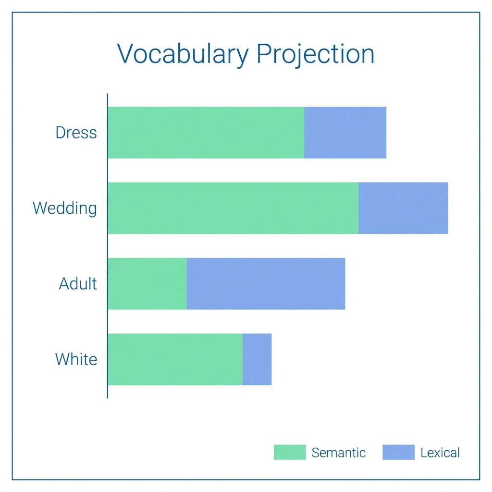
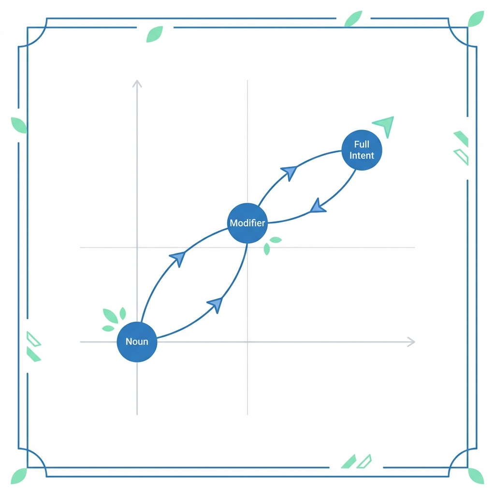
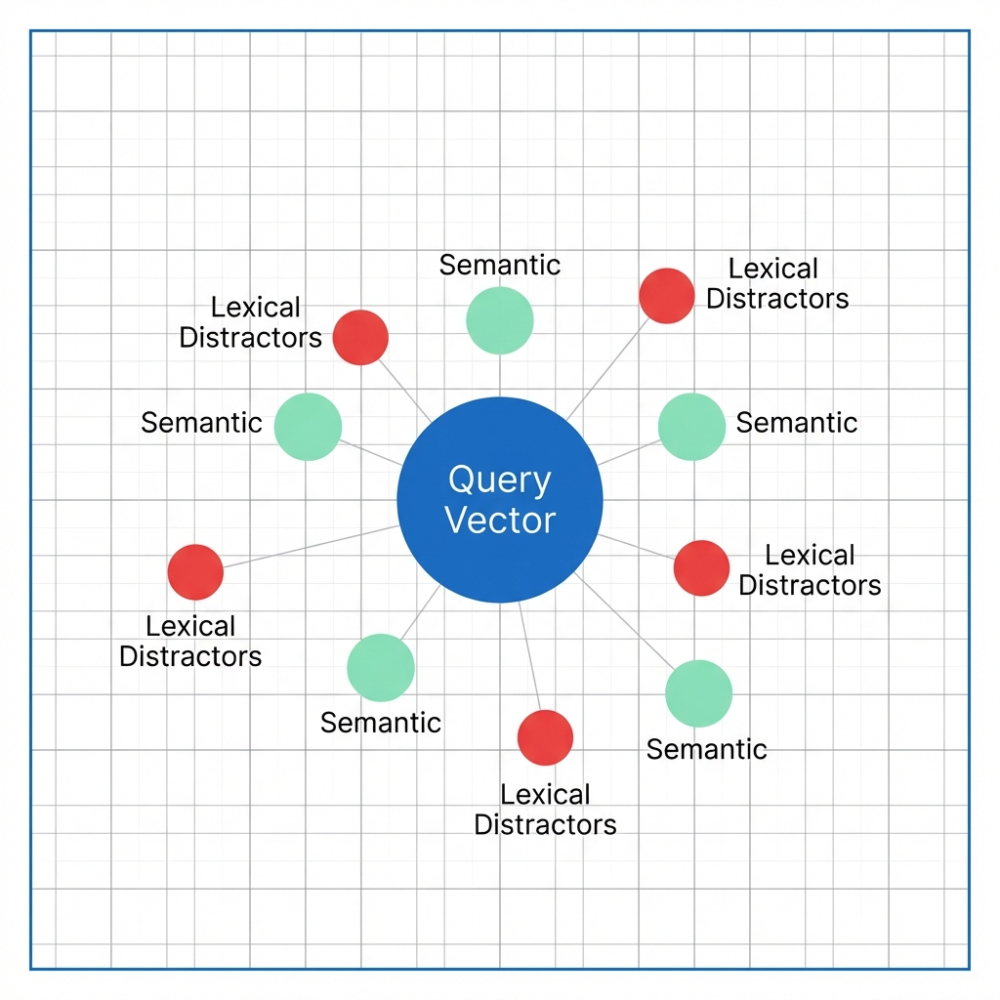

## 🧐 The Paradox of Vector Search

Dense Retrieval (Vector Search) is promised to be the "Semantic Savior"—the technology that finally understands user intent beyond literal keywords. It should excel at sensory queries like "sophisticated" or "fluffy" where traditional BM25 fails.

However, a dangerous phenomenon often occurs during fine-tuning: **Lexical Bias (Selection Bias)**. The model "forgets" how to be semantic and degenerates into a high-dimensional keyword matching engine.

### Why Lexical Bias Occurs

In e-commerce, we typically fine-tune models using **click logs** from existing keyword-based systems. This creates a feedback loop:
1.  **Candidate Restriction**: Logs only contain items that *already* matched the keywords.
2.  **Reward Overfitting**: The model learns that the presence of query words in the title is the strongest predictor of a "click."
3.  **Semantic Atrophy**: The model loses the "degrees of freedom" required to map global concepts, as it becomes overly sensitive to sub-word token overlaps.

---

## 🚨 When Lexical Bias Becomes Critical

Lexical bias isn't always a defect—matching "Nike" for a "Nike" query is good. It becomes a **system failure** in these four regimes:

1.  **The Zero-Hit Rescue**: When keyword search returns nothing, the vector search is the "last hope." If biased, it will also return nothing or irrelevant noise because it's looking for the same missing keywords.
2.  **Sensory & Abstract Intent**: Queries like "elegant dress" or "sturdy table" have no single keyword anchor. A biased model misses the "vibe" and only looks for the nouns.
3.  **Compound Intent Conflict**: In a query like "Apple phone case", a biased model might over-index on "Apple" (the fruit) or "Phone", failing to treat the compound as a single semantic entity.
4.  **Signal Noise (Metadata Overfitting)**: Models often over-react to frequent tokens like "[Free Shipping]" simply because they appear in many clicked items, regardless of their relevance to the true search intent.

---

## 🛠️ The Deep Diagnostic Suite

To move beyond black-box metrics like nDCG, we use a 4-tier qualitative diagnostic framework.

### 1. Intent Exploration (Vocabulary Projection)

We peek inside the model's head by projecting the summary vector ($h \in \mathbb{R}^{768}$) back into the vocabulary space using the original **Masked Language Modeling (MLM)** head.

*Visualizing the Activation: Green bars represent semantic concepts, while blue indicate lexical subword echoes.*

Each strategy revealed a different layer of the model's logic:
*   **Global Intent**: View the final summarized meaning.
*   **Decomposed (Ablation)**: Compare individual tokens vs. the full query to find **Noun Collapse**.
*   **Sequential (Trajectory)**: Trace the vector's path as words are added.
    - **Healthy Transition**: `Dress` → `White Dress` → `Elegant White Dress` (Vector moves in three distinct directions).
    - **Blocked Transition**: Adding "Elegant" does not move the vector. The model is effectively "keyword blind".

*Intent Trajectory: Robust models show clear displacement for each new concept added to the query.*

### 2. Triplet & mapping (The "Conflict")
Combines quantitative metrics with spatial visualization to expose how the model handles conflicting signals.

*Spatial Diagnostic: A biased model will place the Query point closer to the Cluster of Lexical Distractors than the Semantic Positives.*

**Bias Score calculation**:
$$ Score_{bias} = Sim(Query, Neg_{lexical}) - Sim(Query, Pos_{semantic}) $$
*A positive score indicates a model that has "collapsed" into keyword matching.*

---

### 3. Feature Attribution (Gradient Importance)

We identify which specific words "own" the vector by calculating the gradient of the final embedding norm with respect to each input embedding.

#### Implementation Logic:
1.  **Forward Pass**: Calculate query embedding magnitude.
2.  **Backprop**: Compute $\frac{\partial ||f(x)||}{\partial x_i}$ for each token $x_i$.
3.  **Heatmap**: A biased model will show 90%+ importance on the literal keywords, ignoring the context.

---

### 4. Space Health (Anisotropy Detection)

We measure if the global embedding space is healthy or has collapsed into a "narrow cone."

| Symptom | Indicator | Context |
| :--- | :--- | :--- |
| **Space Collapse** | Avg Cosine Sim > 0.8 | All vectors point in the same direction. |
| **Hubness** | Low Uniformity | A few "popular" items appear in every search. |
| **Semantic Drift** | High Anisotropy | The model can't tell "Apple" from "Banana" clearly. |

---

## 🎓 Theoretical Synthesis: Mitigation

If diagnostics reveal high lexical bias, the solution is rarely "more of the same data." We must break the log-bias loop:

-   **Generative Pseudo-Labeling (GPL)**: Generate queries for documents *not* in the logs to force the model to learn new semantic paths.
-   **Cross-Encoder Distillation**: Transfer the complex reasoning of a Cross-Encoder (which "sees" both query and document at once) into the retrieval Bi-Encoder.
-   **Hard Negative Mining**: Force the model to differentiate between "Sophisticated dress" and "Sophisticated toy" during training.

## 🏛️ Conclusion

A search engine that only matches keywords is a broken vector search engine. By using **Vocabulary Projection** and **Intent Mapping**, we ensure that our models are not just "Vector-based Keyword Search" but true engines of semantic understanding.
