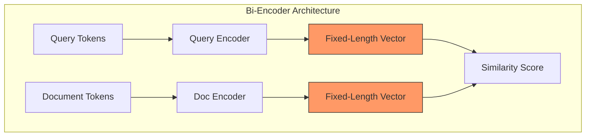

# Pitfalls in Dense Retrieval: Lexical Bias and Beyond

Dense Retrieval (DR), typically implemented via Bi-Encoders, is primarily intended to address the limitations of lexical search. However, despite achieving high nDCG scores on benchmarks like MS MARCO, these models often exhibit structural distortions that cause them to behave like high-dimensional keyword matching engines or fail to capture complex query logic.

This document provides a rigorous analysis of the **Pitfalls** inherent in the Bi-Encoder architecture and the training loops that exacerbate them, grounded in recent information retrieval (IR) literature.

---

## 1. Lexical Bias & Selection Loops

**Overview**: Despite their semantic training, DR models often exhibit a "Lexical Bias"—a failure to retrieve relevant documents without high token overlap while being overly sensitive to irrelevant matches with high overlap.

### Mechanism: Negative Sampling Bias
Most DR models are fine-tuned on click logs or datasets like MS MARCO. These logs are generated by existing BM25 systems, which only present a "Keyword-Filtered" view of the world to the user.
- **Selection Bias**: Training signals are often restricted to query-document pairs that *already* pass the BM25 filter. This lack of exposure prevents the optimization of features required to bridge the "Semantic Gap."
- **Reward Overfitting**: The cross-entropy loss favors the optimization of the easiest signal to distinguish positives from negatives. In a biased dataset, this signal is frequently sub-word overlap.

- **Citation**: [*BEIR: A Heterogeneous Benchmark for Zero-shot Evaluation of Information Retrieval Models* (Thakur et al., 2021)](https://arxiv.org/abs/2104.08663) identifies this as the primary reason DR models fail to generalize to out-of-distribution (OOD) domains where vocabulary differs.

### Mitigation Strategies
- **Generative Pseudo-Labeling (GPL)**: Uses a T5-based model to generate synthetic queries for target documents, circumventing existing click logs. [(*Wang et al., 2021*)](https://arxiv.org/abs/2112.07577)
- **Hard Negative Mining (Denoised)**: Specifically identifying "Lexical Distractors" (high overlap, low relevance) and using them as hard negatives during training to force the model to look beyond surface features. [*RocketQA* (Qu et al., 2021)](https://arxiv.org/abs/2010.08191)

---

## 2. Length Bias in Cosine Similarity

### Mechanism: Vector Magnitude and Normalization
Cosine similarity ($ \frac{A \cdot B}{||A|| ||B||} $) projects representations onto a hypersphere. 
- **Information Density Limits**: A short document like `Nike Shoes` creates a highly directional vector. A long document like `Men's Nike Air Max Running Shoes - Black/White, Size 10` introduces multiple semantic components. 
- **Mechanism**: Each additional concept rotates the document vector away from the primary query vector. In a fixed-dimensional embedding space, adding details can dilute the primary semantic signal.
- **Citation**: [*On the Effects of Document Length on Dense Retrieval* (Zhan et al., 2022)](https://arxiv.org/abs/2211.10841) demonstrates that cosine similarity intrinsically biases toward shorter documents compared to the dot product.

---

## 3. The Content Bottleneck and Representation Limits

**Overview**: DR models struggle with complex, multi-attribute queries (e.g., "Waterproof jacket under $200 for hiking in Norway").

### Mechanism: Fixed-Length Encoding Limits
A Bi-Encoder must compress an entire document/query into a single fixed-length vector ($ \mathbb{R}^d $).
- **Representation Density**: As the number of independent concepts in a query increases, the vector space becomes "crowded." The model may prioritize dominant concepts and omit lower-frequency attributes (e.g., omitting "Waterproof" to focus on "Jacket").
- **Mechanism**: This is the **Representation Bottleneck**. A single vector cannot capture the interaction between $N$ arbitrary tokens without loss.

- **Citation**: The [*ColBERT* paper (Khattab et al., 2020)](https://arxiv.org/abs/2004.12832) argues that single-vector representations are fundamentally insufficient for complex queries and proposes **Late Interaction** (storing token-level embeddings) as the solution.

---

## 4. Anisotropy and Representation Degeneration

**Overview**: The model may lose the ability to distinguish between disparate concepts, leading to semantic drift.

### Mechanism: Anisotropy
- **Mechanism**: Training frequently results in embeddings collapsing into a narrow cone in the vector space.
- **Impact**: Feature clustering might occur where "iPhone" and "Laptop" are mapped close together simply due to a shared "Tech" context, failing to maintain the angular distance required for precise retrieval.
- **Citation**: [*Representation Degeneration Problem in Training Natural Language Generation Models* (Gao et al., 2019)](https://arxiv.org/abs/1907.12009) and [*SimCSE* (Gao et al., 2021)](https://arxiv.org/abs/2104.08821).

### Mitigation
- **Contrastive Learning (SimCSE)**: Uses dropout as noise to pull the same concept together and push everything else apart, effectively "whitening" the space.
- **White-box Whitening**: Applying a linear transformation to the final embeddings to ensure zero mean and identity covariance.

---

## Analysis and Diagnostics

To evaluate these issues systematically, we apply targeted diagnostics to measure specific model behaviors:

### 1. In-Batch Bias Score (IB-Bias)
By calculating the similarity of query $q$ to its lexical distractors (negatives with high overlap) vs. its semantic positives:
$$ Score_{bias} = \mathbb{E}[Sim(q, n_{lexical})] - \mathbb{E}[Sim(q, p_{semantic})] $$
A positive score indicates that the model's retrieval is heavily influenced by lexical overlap.

### 2. Logit Lens (Vocabulary Projection)
We project the hidden state $h$ back into the vocabulary space using the Pre-training MLM head. This reveals whether the model's internal representation is focused on tokens (`n`, `##ike`) or concepts (`sneaker`, `footwear`).

### 3. Attribute Sensitivity Analysis
We perturb queries by adding or removing attributes and monitor the vector trajectory. If the vector displacement is negligible when an attribute is added, the model is failing to encode those specific details.

---

## Summary of Pitfalls and Mitigations

| Pitfall | Root Cause | Key Citation | Mitigation Strategy |
| :--- | :--- | :--- | :--- |
| **Lexical Bias** | Biased Click Logs (Selection Bias) | [BEIR (Thakur, 2021)](https://arxiv.org/abs/2104.08663) | [GPL](https://arxiv.org/abs/2112.07577), Cross-Encoder Distillation |
| **Length Bias** | Cosine Normalization Artifacts | [Zhan et al. (2022)](https://arxiv.org/abs/2211.10841) | Max-Pooling, Learned Norms |
| **Content Bottleneck** | Fixed-Vector Compression | [ColBERT (Khattab, 2020)](https://arxiv.org/abs/2004.12832) | Late Interaction, Multi-Vector |
| **Anisotropy** | Weight Degeneration | [Gao et al. (2019)](https://arxiv.org/abs/1907.12009) | [SimCSE (Gao, 2021)](https://arxiv.org/abs/2104.08821), Whitening |
| **Granularity Loss** | Weak Detail Encoding | [BGE-M3 (Chen, 2024)](https://arxiv.org/abs/2402.03216) | Hard Negative Mining (Harder) |

## Conclusion

Pitfalls in Dense Retrieval are predictable systemic failures of the Bi-Encoder architecture and the training data supply chain. By moving from heuristic tuning to systematic diagnosis, we can build retrieval systems that are truly semantic, rather than high-dimensional keyword matching systems.
